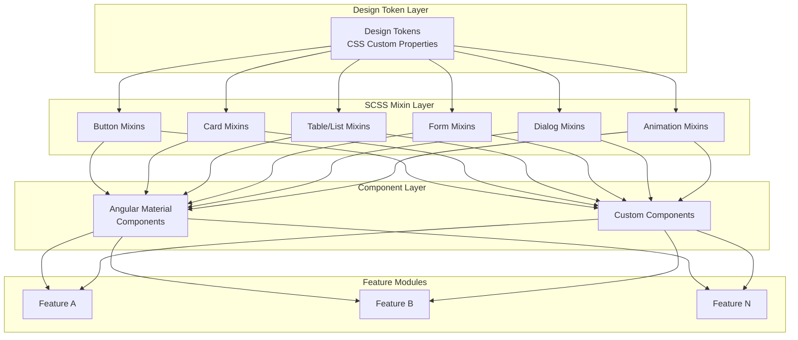

# Design Document: Premium Standardized UI Design System

## Overview

This design document defines a comprehensive, premium design system for the Angular frontend application. The system establishes CSS custom properties (design tokens) as the single source of truth, standardized component styles, and reusable SCSS mixins to eliminate existing inconsistencies and create a cohesive, professional user experience.

The design system builds upon the existing Vuexy-inspired foundation in `_vuexy-vars.scss` and `_shared-list-styles.scss`, consolidating patterns and extending them with premium interactions.

## Architecture

### Design System Architecture



### File Structure

```
frontend/src/styles/
├── _design-tokens.scss       # CSS custom properties (NEW)
├── _vuexy-vars.scss          # SCSS variables (UPDATED - references tokens)
├── _mixins/
│   ├── _index.scss           # Mixin barrel export
│   ├── _buttons.scss         # Button mixins
│   ├── _cards.scss           # Card mixins
│   ├── _tables.scss          # Table/list mixins
│   ├── _forms.scss           # Form field mixins
│   ├── _dialogs.scss         # Dialog mixins
│   ├── _animations.scss      # Transition/animation mixins
│   └── _utilities.scss       # Utility mixins
├── _shared-list-styles.scss  # Existing mixins (REFACTORED)
├── _vuexy-helpers.scss       # Helper classes (UPDATED)
└── styles.scss               # Main stylesheet (imports all)
```

## Components and Interfaces

### Design Token System

The design token system uses CSS custom properties for runtime flexibility and SCSS variables for compile-time use.

```scss
// _design-tokens.scss
:root {
  // ============================================
  // COLOR TOKENS
  // ============================================
  
  // Primary Palette
  --color-primary: #7367F0;
  --color-primary-dark: #5E50EE;
  --color-primary-light: #9E95F5;
  --color-primary-rgb: 115, 103, 240;
  
  // Secondary Palette
  --color-secondary: #82868B;
  --color-secondary-dark: #6E6B7B;
  --color-secondary-light: #B8B8B8;
  
  // Semantic Colors
  --color-success: #28C76F;
  --color-info: #00CFE8;
  --color-warning: #FF9F43;
  --color-danger: #EA5455;
  
  // Neutral Colors
  --color-text-primary: #5E5873;
  --color-text-body: #6E6B7B;
  --color-text-muted: #B8B8B8;
  --color-text-inverse: #FFFFFF;
  
  // Background Colors
  --color-bg-page: #F8F9FC;
  --color-bg-card: #FFFFFF;
  --color-bg-elevated: #FFFFFF;
  --color-bg-hover: rgba(115, 103, 240, 0.04);
  --color-bg-selected: rgba(115, 103, 240, 0.08);
  
  // Border Colors
  --color-border: #EBE9F1;
  --color-border-input: #D8D6DE;
  --color-border-focus: #7367F0;
  
  // ============================================
  // SPACING TOKENS (4px base unit)
  // ============================================
  --space-0: 0;
  --space-1: 4px;
  --space-2: 8px;
  --space-3: 12px;
  --space-4: 16px;
  --space-5: 20px;
  --space-6: 24px;
  --space-8: 32px;
  --space-10: 40px;
  --space-12: 48px;
  --space-16: 64px;
  
  // ============================================
  // TYPOGRAPHY TOKENS
  // ============================================
  --font-family: 'Montserrat', -apple-system, BlinkMacSystemFont, sans-serif;
  
  // Font Sizes
  --font-size-xs: 11px;
  --font-size-sm: 13px;
  --font-size-base: 14px;
  --font-size-md: 16px;
  --font-size-lg: 18px;
  --font-size-xl: 20px;
  --font-size-2xl: 24px;
  --font-size-3xl: 28px;
  --font-size-4xl: 32px;
  
  // Font Weights
  --font-weight-normal: 400;
  --font-weight-medium: 500;
  --font-weight-semibold: 600;
  --font-weight-bold: 700;
  
  // Line Heights
  --line-height-tight: 1.2;
  --line-height-snug: 1.35;
  --line-height-base: 1.45;
  --line-height-relaxed: 1.5;
  
  // ============================================
  // BORDER RADIUS TOKENS
  // ============================================
  --radius-none: 0;
  --radius-sm: 4px;
  --radius-md: 6px;
  --radius-lg: 8px;
  --radius-xl: 10px;
  --radius-2xl: 12px;
  --radius-full: 9999px;
  
  // ============================================
  // SHADOW TOKENS
  // ============================================
  --shadow-none: none;
  --shadow-sm: 0 1px 2px rgba(34, 41, 47, 0.05);
  --shadow-md: 0 2px 8px rgba(34, 41, 47, 0.08);
  --shadow-lg: 0 4px 16px rgba(34, 41, 47, 0.1);
  --shadow-xl: 0 8px 24px rgba(34, 41, 47, 0.12);
  --shadow-2xl: 0 12px 32px rgba(34, 41, 47, 0.16);
  
  // Component-specific shadows
  --shadow-card: 0 2px 10px rgba(0, 0, 0, 0.08);
  --shadow-button: 0 4px 12px rgba(34, 41, 47, 0.24);
  --shadow-dropdown: 0 5px 25px rgba(34, 41, 47, 0.18);
  --shadow-modal: 0 10px 30px rgba(34, 41, 47, 0.2);
  --shadow-primary-glow: 0 0 20px rgba(115, 103, 240, 0.4);
  
  // ============================================
  // TRANSITION TOKENS
  // ============================================
  --transition-fast: 150ms ease-out;
  --transition-base: 200ms ease-out;
  --transition-slow: 300ms ease-out;
  --transition-slower: 400ms ease-out;
  
  // Easing Functions
  --ease-out: cubic-bezier(0.4, 0, 0.2, 1);
  --ease-in-out: cubic-bezier(0.4, 0, 0.2, 1);
  --ease-bounce: cubic-bezier(0.34, 1.56, 0.64, 1);
  
  // ============================================
  // COMPONENT SIZE TOKENS
  // ============================================
  --button-height: 44px;
  --button-height-sm: 36px;
  --button-height-lg: 48px;
  
  --input-height: 44px;
  --input-height-sm: 36px;
  --input-height-lg: 48px;
  
  --touch-target-min: 44px;  // Fitts's Law compliance
  
  // ============================================
  // Z-INDEX TOKENS
  // ============================================
  --z-dropdown: 100;
  --z-sticky: 200;
  --z-fixed: 300;
  --z-modal-backdrop: 400;
  --z-modal: 500;
  --z-popover: 600;
  --z-tooltip: 700;
}

// Dark mode support (future)
@media (prefers-color-scheme: dark) {
  :root {
    // Dark mode tokens would go here
  }
}

// Reduced motion support
@media (prefers-reduced-motion: reduce) {
  :root {
    --transition-fast: 0ms;
    --transition-base: 0ms;
    --transition-slow: 0ms;
    --transition-slower: 0ms;
  }
}
```

### Button Component

Standardized button styles with consistent dimensions and premium hover effects.

```scss
// _mixins/_buttons.scss

// Base button mixin
@mixin button-base {
  display: inline-flex;
  align-items: center;
  justify-content: center;
  gap: var(--space-2);
  height: var(--button-height);
  min-width: 80px;
  padding: 0 var(--space-4);
  font-family: var(--font-family);
  font-size: var(--font-size-base);
  font-weight: var(--font-weight-medium);
  letter-spacing: 0.4px;
  text-transform: uppercase;
  border: none;
  border-radius: var(--radius-md);
  cursor: pointer;
  transition: all var(--transition-base);
  
  &:disabled {
    opacity: 0.65;
    cursor: not-allowed;
    transform: none !important;
  }
}

// Primary button
@mixin button-primary {
  @include button-base;
  background: linear-gradient(135deg, var(--color-primary) 0%, var(--color-primary-dark) 100%);
  color: var(--color-text-inverse);
  box-shadow: var(--shadow-button);
  
  &:hover:not(:disabled) {
    transform: translateY(-1px);
    box-shadow: var(--shadow-primary-glow), var(--shadow-lg);
  }
  
  &:active:not(:disabled) {
    transform: translateY(0);
  }
}

// Secondary button
@mixin button-secondary {
  @include button-base;
  background-color: var(--color-secondary);
  color: var(--color-text-inverse);
  
  &:hover:not(:disabled) {
    background-color: var(--color-secondary-dark);
  }
}

// Outline button
@mixin button-outline {
  @include button-base;
  background-color: transparent;
  border: 2px solid var(--color-border-input);
  color: var(--color-text-body);
  
  &:hover:not(:disabled) {
    border-color: var(--color-primary);
    color: var(--color-primary);
    background-color: var(--color-bg-hover);
  }
}

// Icon button (Fitts's Law compliant)
@mixin button-icon {
  display: inline-flex;
  align-items: center;
  justify-content: center;
  width: var(--touch-target-min);
  height: var(--touch-target-min);
  padding: 0;
  border-radius: var(--radius-lg);
  background-color: transparent;
  border: none;
  cursor: pointer;
  transition: all var(--transition-fast);
  
  mat-icon {
    font-size: 20px;
    width: 20px;
    height: 20px;
  }
  
  &:hover {
    background-color: var(--color-bg-hover);
  }
  
  &.primary:hover {
    background-color: rgba(var(--color-primary-rgb), 0.12);
    color: var(--color-primary);
  }
  
  &.danger:hover {
    background-color: rgba(234, 84, 85, 0.12);
    color: var(--color-danger);
  }
}
```

### Card Component

Standardized card styles with consistent padding, radius, and shadows.

```scss
// _mixins/_cards.scss

@mixin card-base {
  background: var(--color-bg-card);
  border-radius: var(--radius-lg);
  box-shadow: var(--shadow-card);
  border: 1px solid var(--color-border);
  overflow: hidden;
}

@mixin card-padding {
  padding: var(--space-6);
}

@mixin card-header {
  display: flex;
  justify-content: space-between;
  align-items: center;
  padding: var(--space-6) var(--space-6) var(--space-4);
  border-bottom: none;
  
  .card-title {
    font-size: var(--font-size-lg);
    font-weight: var(--font-weight-semibold);
    color: var(--color-text-primary);
    margin: 0;
    display: flex;
    align-items: center;
    gap: var(--space-3);
    
    mat-icon {
      color: var(--color-primary);
    }
  }
  
  .card-subtitle {
    font-size: var(--font-size-sm);
    color: var(--color-text-muted);
    margin-top: var(--space-1);
  }
}

@mixin card-body {
  padding: 0 var(--space-6) var(--space-6);
}

@mixin card-footer {
  display: flex;
  justify-content: flex-end;
  gap: var(--space-3);
  padding: var(--space-4) var(--space-6);
  border-top: 1px solid var(--color-border);
  background-color: var(--color-bg-page);
}

// Premium stat card (for dashboards)
@mixin stat-card {
  background: var(--color-bg-card);
  border-radius: var(--radius-2xl);
  padding: var(--space-5);
  display: flex;
  align-items: center;
  gap: var(--space-4);
  box-shadow: var(--shadow-card);
  border: 1px solid rgba(var(--color-primary-rgb), 0.05);
  transition: all var(--transition-slow);
  position: relative;
  overflow: hidden;
  
  &::before {
    content: '';
    position: absolute;
    top: 0;
    left: 0;
    width: 4px;
    height: 100%;
    background: var(--stat-color, var(--color-primary));
    opacity: 0.8;
  }
  
  &:hover {
    transform: translateY(-4px);
    box-shadow: 0 8px 24px rgba(var(--color-primary-rgb), 0.12);
    border-color: rgba(var(--color-primary-rgb), 0.2);
  }
}
```

### Table/List Component

Standardized table and list styles with consistent row styling and hover effects.

```scss
// _mixins/_tables.scss

@mixin table-container {
  padding: 0 var(--space-6);
}

@mixin data-table {
  width: 100%;
  background: transparent !important;
  border-collapse: separate;
  border-spacing: 0 var(--space-2);
  
  // Header row
  .mat-mdc-header-row,
  thead tr {
    background: linear-gradient(135deg, var(--color-primary) 0%, rgba(var(--color-primary-rgb), 0.86) 100%) !important;
    height: 48px;
    
    th {
      color: var(--color-text-inverse) !important;
      font-size: var(--font-size-sm);
      font-weight: var(--font-weight-semibold);
      text-transform: uppercase;
      letter-spacing: 0.5px;
      border: none;
      padding: 0 var(--space-4);
    }
  }
  
  // Data rows
  .mat-mdc-row,
  tbody tr {
    background: var(--color-bg-card);
    box-shadow: var(--shadow-sm);
    transition: all var(--transition-base);
    
    td {
      border: none;
      padding: var(--space-3) var(--space-4);
      color: var(--color-text-body);
      font-size: var(--font-size-base);
      border-bottom: 1px solid rgba(0, 0, 0, 0.03);
    }
    
    &:hover {
      background-color: var(--color-bg-card) !important;
      box-shadow: 0 8px 24px rgba(var(--color-primary-rgb), 0.12);
      transform: translateY(-2px);
      border-left: 3px solid var(--color-primary);
      
      td {
        color: var(--color-primary-dark) !important;
      }
    }
  }
}

@mixin list-item {
  display: flex;
  align-items: center;
  padding: var(--space-3) var(--space-4);
  background: var(--color-bg-card);
  border-radius: var(--radius-lg);
  margin-bottom: var(--space-2);
  transition: all var(--transition-fast);
  
  &:hover {
    background: var(--color-bg-hover);
    transform: translateX(4px);
  }
}
```

### Form/Filter Component

Standardized form field and filter section styles.

```scss
// _mixins/_forms.scss

@mixin form-field-base {
  width: 100%;
  
  ::ng-deep .mat-mdc-form-field {
    width: 100%;
    
    .mat-mdc-text-field-wrapper {
      height: var(--input-height);
      background-color: var(--color-bg-card) !important;
    }
    
    .mat-mdc-form-field-flex {
      height: var(--input-height);
      align-items: center;
    }
    
    .mat-mdc-form-field-infix {
      min-height: var(--input-height);
    }
    
    .mdc-text-field--outlined {
      border-radius: var(--radius-xl) !important;
    }
    
    .mdc-notched-outline__leading,
    .mdc-notched-outline__notch,
    .mdc-notched-outline__trailing {
      border-color: var(--color-border-input) !important;
      border-width: 1px !important;
    }
    
    &:hover,
    &.mat-focused {
      .mdc-notched-outline__leading,
      .mdc-notched-outline__notch,
      .mdc-notched-outline__trailing {
        border-color: var(--color-primary) !important;
        border-width: 2px !important;
      }
    }
    
    .mat-mdc-floating-label {
      color: var(--color-text-primary) !important;
      font-weight: var(--font-weight-medium);
    }
    
    &.mat-focused .mat-mdc-floating-label {
      color: var(--color-primary) !important;
    }
    
    .mat-mdc-input-element {
      color: var(--color-text-body) !important;
      caret-color: var(--color-primary) !important;
    }
    
    .mat-mdc-select-arrow {
      color: var(--color-primary) !important;
    }
  }
}

@mixin filter-section {
  padding: var(--space-4) var(--space-6);
  display: flex;
  align-items: center;
  gap: var(--space-4);
  flex-wrap: wrap;
  background: var(--color-bg-card);
  border-bottom: 1px solid rgba(var(--color-primary-rgb), 0.08);
  
  .filter-group {
    display: flex;
    align-items: center;
    gap: var(--space-4);
    flex-wrap: wrap;
  }
  
  .search-field {
    flex: 1;
    min-width: 280px;
    
    @include form-field-base;
  }
  
  .filter-field {
    min-width: 160px;
    flex: 0 1 auto;
    
    @include form-field-base;
  }
}
```

### Dialog Component

Standardized dialog styles with consistent header, body, and footer styling.

```scss
// _mixins/_dialogs.scss

@mixin dialog-container {
  @include form-field-base;
  
  .form-dialog-shell {
    background: var(--color-bg-card);
    border-radius: var(--radius-2xl);
    overflow: hidden;
    display: flex;
    flex-direction: column;
    width: min(760px, 100%);
    max-width: 100%;
    max-height: 92vh;
    box-shadow: var(--shadow-modal);
  }
  
  .dialog-header {
    display: flex;
    justify-content: space-between;
    align-items: flex-start;
    gap: var(--space-5);
    padding: var(--space-6) var(--space-7);
    background: linear-gradient(135deg, var(--color-primary) 0%, var(--color-primary-dark) 100%);
    color: var(--color-text-inverse);
  }
  
  .header-icon {
    width: 46px;
    height: 46px;
    border-radius: var(--radius-xl);
    background: rgba(255, 255, 255, 0.16);
    color: var(--color-text-inverse);
    display: inline-flex;
    align-items: center;
    justify-content: center;
  }
  
  .dialog-content {
    padding: var(--space-7) !important;
    background: var(--color-bg-page) !important;
    overflow-y: auto;
    flex: 1;
  }
  
  .dialog-footer {
    padding: var(--space-5) var(--space-7) !important;
    background: var(--color-bg-card);
    border-top: 1px solid var(--color-border);
    display: flex !important;
    align-items: center;
    justify-content: space-between !important;
    gap: var(--space-4);
  }
  
  .footer-actions {
    display: flex;
    align-items: center;
    gap: var(--space-3);
  }
  
  .submit-btn {
    @include button-primary;
    min-width: 132px;
  }
  
  .cancel-btn {
    @include button-outline;
    min-width: 110px;
  }
}
```

### Animation Mixins

Premium transition and animation mixins.

```scss
// _mixins/_animations.scss

// Hover lift effect
@mixin hover-lift($distance: -4px) {
  transition: transform var(--transition-base), box-shadow var(--transition-base);
  
  &:hover {
    transform: translateY($distance);
  }
}

// Glow effect on hover
@mixin hover-glow($color: var(--color-primary)) {
  transition: box-shadow var(--transition-base);
  
  &:hover {
    box-shadow: 0 0 20px rgba($color, 0.4);
  }
}

// Smooth color transition
@mixin smooth-color($property: background-color) {
  transition: $property var(--transition-fast);
}

// Scale on hover
@mixin hover-scale($scale: 1.02) {
  transition: transform var(--transition-fast);
  
  &:hover {
    transform: scale($scale);
  }
}

// Fade in animation
@mixin fade-in($duration: var(--transition-base)) {
  animation: fadeIn $duration ease-out;
  
  @keyframes fadeIn {
    from {
      opacity: 0;
    }
    to {
      opacity: 1;
    }
  }
}

// Slide up animation
@mixin slide-up($distance: 20px, $duration: var(--transition-slow)) {
  animation: slideUp $duration ease-out;
  
  @keyframes slideUp {
    from {
      opacity: 0;
      transform: translateY($distance);
    }
    to {
      opacity: 1;
      transform: translateY(0);
    }
  }
}

// Reduced motion support
@mixin reduced-motion {
  @media (prefers-reduced-motion: reduce) {
    animation: none !important;
    transition: none !important;
  }
}
```

## Data Models

### Design Token Interface

```typescript
// Design token types for TypeScript support
interface DesignTokens {
  colors: {
    primary: string;
    primaryDark: string;
    primaryLight: string;
    secondary: string;
    success: string;
    info: string;
    warning: string;
    danger: string;
    textPrimary: string;
    textBody: string;
    textMuted: string;
    bgPage: string;
    bgCard: string;
    border: string;
  };
  spacing: {
    [key: number]: string; // space-0 through space-16
  };
  typography: {
    fontFamily: string;
    fontSizes: Record<string, string>;
    fontWeights: Record<string, number>;
    lineHeights: Record<string, number>;
  };
  borderRadius: {
    [key: string]: string;
  };
  shadows: {
    [key: string]: string;
  };
  transitions: {
    [key: string]: string;
  };
}
```

## Correctness Properties

*A property is a characteristic or behavior that should hold true across all valid executions of a system-essentially, a formal statement about what the system should do. Properties serve as the bridge between human-readable specifications and machine-verifiable correctness guarantees.*<tool_call>prework<arg_key>featureName</arg_key><arg_value>ui-design-system

### Property Reflection

After analyzing all acceptance criteria, I've identified several areas where properties can be consolidated:

1. **Button height properties (2.1, 2.6)**: Both test the 44px minimum touch target - consolidated into one property
2. **Transition/animation properties (10.3, 10.4, 10.5)**: These overlap with 9.4 (reduced motion) - consolidated
3. **Token existence properties (1.1, 1.4, 1.5)**: Can be combined into a single comprehensive token existence property
4. **Design token usage properties (4.4, 6.4, 7.6)**: All test that components use tokens - consolidated

### Correctness Properties

**Property 1: Design Token Completeness**
*For any* design token category (colors, spacing, typography, shadows, border-radius), all required tokens SHALL be defined as CSS custom properties with correct naming conventions.
**Validates: Requirements 1.1, 1.2, 1.4, 1.5**

**Property 2: Spacing Token Multiples**
*For any* spacing token value, the value SHALL be a multiple of 4px (the base spacing unit).
**Validates: Requirements 1.3**

**Property 3: Token Update Propagation**
*For any* CSS custom property token, when the token value is updated at runtime, all elements using that token SHALL reflect the new computed style immediately.
**Validates: Requirements 1.6**

**Property 4: Button Touch Target Compliance**
*For any* button variant (primary, secondary, outline, icon), the computed height SHALL be exactly 44px and the minimum touch target SHALL be 44px × 44px.
**Validates: Requirements 2.1, 2.6**

**Property 5: Button Border Radius Consistency**
*For any* button variant, the computed border-radius SHALL be exactly 6px.
**Validates: Requirements 2.2**

**Property 6: Button Hover Transitions**
*For any* button, the hover state SHALL include a CSS transition with duration between 150ms and 300ms.
**Validates: Requirements 2.4**

**Property 7: Button Disabled State**
*For any* button with the disabled attribute, the computed opacity SHALL be 0.65 and pointer-events SHALL be prevented.
**Validates: Requirements 2.5**

**Property 8: Card Dimensions**
*For any* card component, the computed padding SHALL be 24px and the computed border-radius SHALL be 8px.
**Validates: Requirements 3.1, 3.2**

**Property 9: Card Shadow Token Usage**
*For any* card component, the box-shadow value SHALL match the defined shadow token (--shadow-card).
**Validates: Requirements 3.3**

**Property 10: Table Row Consistency**
*For any* table row within the same table, all rows SHALL have identical computed height and padding values.
**Validates: Requirements 4.2**

**Property 11: Table Row Hover Effect**
*For any* table row, the hover state SHALL apply a transform and/or box-shadow change with a CSS transition.
**Validates: Requirements 4.3**

**Property 12: Design Token Usage in Components**
*For any* component style rule referencing colors, spacing, shadows, or border-radius, the value SHALL reference a CSS custom property token rather than a hardcoded value.
**Validates: Requirements 4.4, 6.4, 7.6**

**Property 13: Filter Section Input Height**
*For any* input field within a filter section, the computed height SHALL be 44px.
**Validates: Requirements 5.3**

**Property 14: Dialog Body Padding**
*For any* dialog component body, the computed padding SHALL be 24px.
**Validates: Requirements 6.2**

**Property 15: Mixin Library Completeness**
*For each* required UI pattern (button, card, table, form, dialog, animation), a corresponding mixin SHALL be defined in the mixins library.
**Validates: Requirements 7.1, 7.2, 7.3, 7.4, 7.5**

**Property 16: No Duplicate Style Definitions**
*For any* style property definition in a feature module, the same property SHALL NOT be duplicated in another feature module with the same value.
**Validates: Requirements 8.1, 8.2**

**Property 17: Touch Target Minimum**
*For any* interactive element (button, input, select, clickable icon), the minimum dimension SHALL be at least 44px.
**Validates: Requirements 9.1**

**Property 18: Color Contrast Ratio**
*For any* text element, the contrast ratio between the text color and background color SHALL be at least 4.5:1.
**Validates: Requirements 9.2**

**Property 19: Focus Indicator Visibility**
*For any* focusable element, the focus state SHALL include a visible style change (outline, box-shadow, or border) that differs from the default state.
**Validates: Requirements 9.3**

**Property 20: Reduced Motion Support**
*For any* element with CSS transitions or animations, when the user prefers reduced motion, the transition duration SHALL be 0ms or the animation SHALL be disabled.
**Validates: Requirements 9.4, 10.5**

**Property 21: Hover State Non-Color Changes**
*For any* interactive element with a hover state, the hover styles SHALL include at least one non-color property change (transform, box-shadow, border, or outline).
**Validates: Requirements 9.5**

**Property 22: Transition Token Definitions**
*For each* standard transition duration (fast, base, slow), a corresponding CSS custom property SHALL be defined with values 150ms, 200ms, and 300ms respectively.
**Validates: Requirements 10.1**

**Property 23: Easing Function Definitions**
*For each* standard easing function (ease-out, ease-in-out), a corresponding CSS custom property SHALL be defined.
**Validates: Requirements 10.2**

## Error Handling

### Design Token Errors

| Error Condition | Handling |
|----------------|----------|
| Missing token reference | Log warning in development, fall back to default value |
| Invalid token value | SCSS compilation error with descriptive message |
| Circular token reference | SCSS compilation error detecting the cycle |

### Component Style Errors

| Error Condition | Handling |
|----------------|----------|
| Missing mixin import | SCSS compilation error indicating missing import |
| Invalid mixin argument | SCSS compilation error with expected vs received types |
| Override conflict | Log warning when feature module overrides design system values |

### Runtime Errors

| Error Condition | Handling |
|----------------|----------|
| CSS custom property not supported | Graceful degradation to SCSS variable defaults |
| Browser doesn't support prefers-reduced-motion | Animations work normally (no error) |

## Testing Strategy

### Unit Testing

Unit tests will verify specific component styles and edge cases:

1. **Token Value Tests**: Verify each design token has the expected value
2. **Mixin Output Tests**: Verify mixins generate correct CSS output
3. **Component Variant Tests**: Verify each component variant renders correctly
4. **Edge Case Tests**: Test disabled states, empty states, error states

### Property-Based Testing

Property-based tests will validate universal correctness properties using a CSS testing framework:

**Test Configuration:**
- Library: `fast-check` for property generation
- Framework: Jest with `jest-css-modules` or similar
- Minimum iterations: 100 per property test
- Each test tagged with: `Feature: ui-design-system, Property N: [property_text]`

**Property Test Categories:**

1. **Dimension Properties** (Properties 4, 5, 8, 13, 14, 17)
   - Generate random component instances
   - Verify computed dimensions match specifications

2. **Token Properties** (Properties 1, 2, 3, 12, 22, 23)
   - Generate random token names
   - Verify tokens exist and have correct values
   - Verify token propagation works

3. **State Properties** (Properties 6, 7, 11, 19, 20, 21)
   - Generate random component states
   - Verify state transitions and behaviors

4. **Consistency Properties** (Properties 10, 15, 16)
   - Generate random component pairs
   - Verify consistency across instances

5. **Accessibility Properties** (Properties 17, 18, 19, 20)
   - Generate random interactive elements
   - Verify accessibility compliance

### Visual Regression Testing

Visual regression tests will ensure visual consistency:

1. **Baseline Screenshots**: Capture screenshots of all component variants
2. **Comparison Tests**: Compare new screenshots against baselines
3. **Threshold**: Allow 0.1% pixel difference for anti-aliasing variations

### Integration Testing

Integration tests will verify the design system works across the application:

1. **Import Tests**: Verify all mixins can be imported without errors
2. **Build Tests**: Verify the application builds successfully with the design system
3. **Runtime Tests**: Verify CSS custom properties work at runtime
